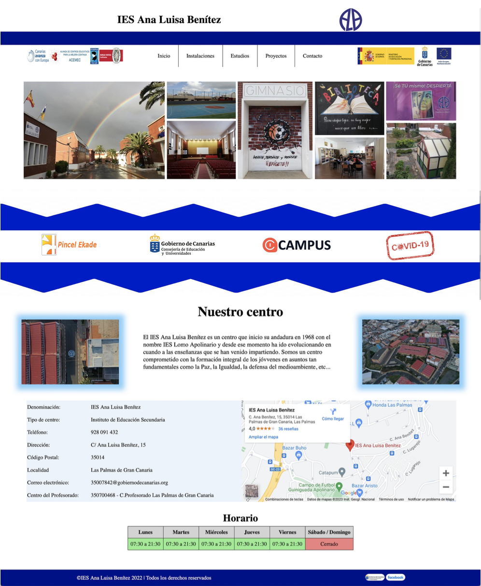

# ⚠️ Antes de comenzar ⚠️
Importante aclarar que no es una página web real, es un proyecto creado para el módulo Lenguaje de marcas y gestión de información de primero de ciclo de Desarrollo de Aplicaciones Web.

# IES Ana Luisa Benitez
Este proyecto es un rediseño de la página web del instituto IES Ana Luisa Benitez. La cuál solo estética (no es funcional).

# Página principal

# Uso de la aplicación
## 👤Usuario sin cuenta
El usuario que no sea alumno mayor de edad, padre / madre de alumno menor de edad o profesor del instituto solo podrá visualizar la página que contenga información del centro.

## 👤Usuario con cuenta
Los usuarios con cuenta serán alumnos mayores de edad, padre / madre de alumnos menores de edad o profesores del instituto, al pertenecer al centro tendrán acceso a más apartados de la web, como por ejemplom acceder a los datos personales de dicho alumno o profesor (sus horarios, sus profesores, etc).

# 🪛Tecnologías.
Para llevar a cabo la reaización de este proyecto, he utilizado:
* HTML
* CSS
* Github

# Autora
* Sara Marrero Miranda

## 🔔 AVISO
El proyecto es de primero de ciclo, en la actualidad tengo muchos más conocimientos por lo que el proyecto está incompleto, actualmente estoy mejorando el código existente y ampliandolo.
